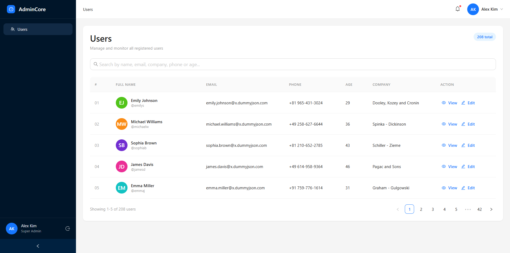
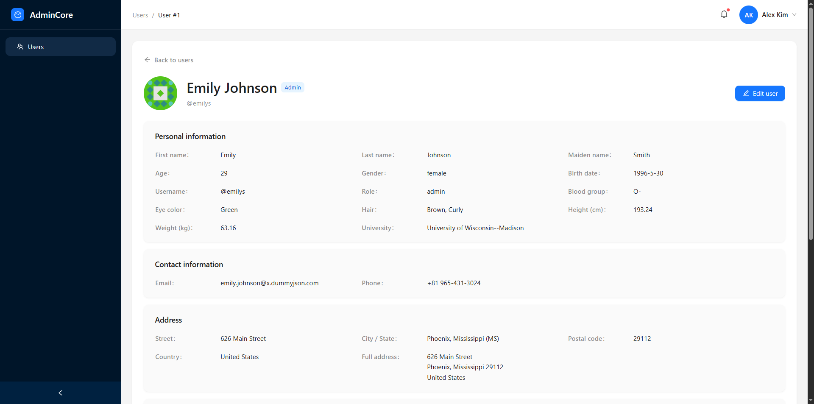
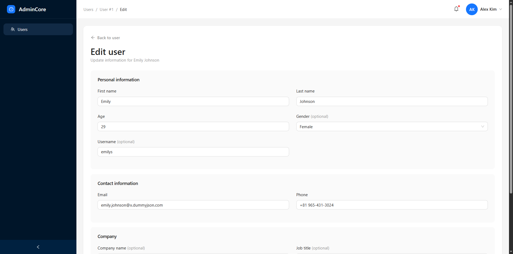
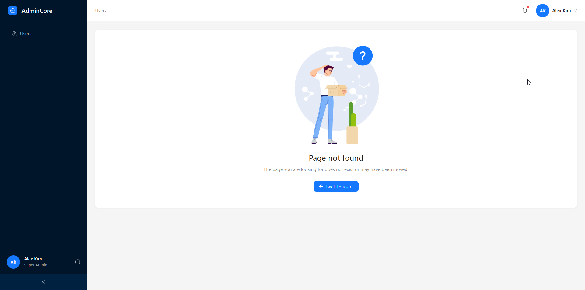
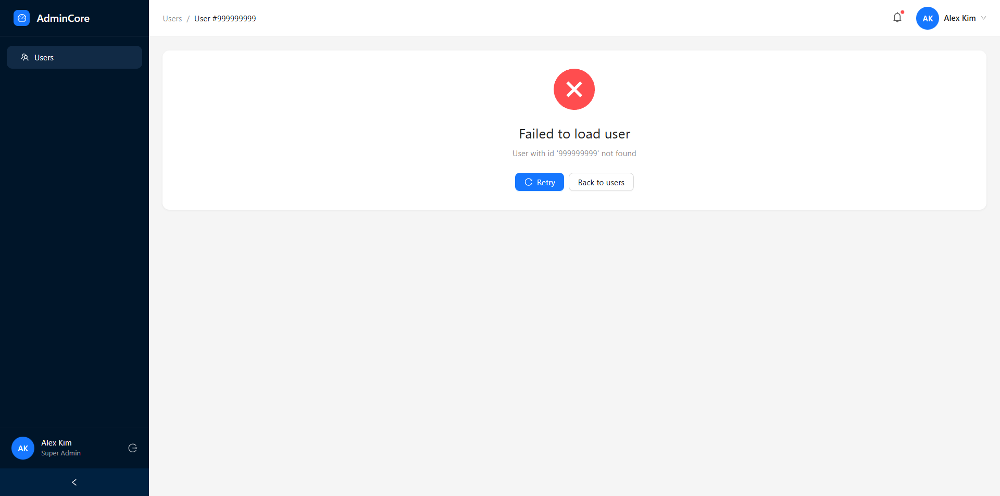

# AdminCore — Users Management Dashboard

Frontend technical challenge for **Kala**. A responsive admin dashboard to browse, search, view, and edit users powered by the [DummyJSON](https://dummyjson.com) API.

## Tech stack

| Category | Technology |
|----------|------------|
| Framework | React 19, TypeScript |
| Build tool | Vite |
| UI | Ant Design, Sass |
| Routing | React Router (`createBrowserRouter`) |
| Client UI state | Redux Toolkit |
| Server state | TanStack Query |
| HTTP | Axios |

## Features

- **Users table** with server-side pagination (client-side filtering + pagination when searching)
- **Debounced search** across name, email, company, phone, and age
- **User detail page** with structured profile sections
- **User edit form** with validation and save feedback
- **Loading, error, and empty states** on list, detail, and edit flows
- **URL query param sync** for shareable list URLs (`search`, `page`, `pageSize`)
- **Responsive layout** with collapsible sidebar and mobile drawer navigation
- **React Query cache updates** after edit so changes remain visible without a full refetch
- **Custom 404 and route error pages** inside the main layout

## Screenshots

### Users list



### User detail



### User edit



### Page not found (404)



### User not found



## Project structure

```
src/
├── app/          # App shell: router, providers, Ant Design theme
├── features/     # Domain modules (e.g. users: pages, components, hooks, API)
├── shared/       # Cross-feature UI, hooks, constants, navigation helpers
├── store/        # Redux store setup and typed hooks
├── lib/          # Shared infrastructure (API client, QueryClient)
└── styles/       # Global Sass variables and layout styles
```

- **`app/`** — Application entry wiring: `RouterProvider`, Redux/Query providers, theme.
- **`features/`** — Feature-first modules. The `users` feature owns list/detail/edit pages, API calls, hooks, and feature styles.
- **`shared/`** — Reusable layout (sidebar, header, breadcrumbs), route pages (404/error), and shared utilities.
- **`store/`** — Global Redux configuration. Currently holds UI-only state for the users list.
- **`lib/`** — Axios instance and TanStack Query client defaults.
- **`styles/`** — Global design tokens and layout primitives (e.g. `.page-shell`).

## State management

**Redux Toolkit (UI state only)**

- Search term, current page, and page size for the users list.
- Synced with URL query parameters for shareable links.

**TanStack Query (server state)**

- Fetching paginated users, single user details, and update mutations.
- Cached by structured query keys; manual cache updates after successful edits.

This separation keeps ephemeral UI concerns out of the server cache and avoids duplicating API data in Redux.

## Running locally

### Prerequisites

- Node.js 20+
- npm

### Setup

```bash
npm install
cp .env.example .env
```

### Environment variables

Create a `.env` file in the project root:

```env
VITE_API_BASE_URL=https://dummyjson.com
```

### Development

```bash
npm run dev
```

Open [http://localhost:5173](http://localhost:5173).

### Production build

```bash
npm run build
```

Preview the production build:

```bash
npm run preview
```

### Lint

```bash
npm run lint
```

## Example routes for testing

Replace the host with your dev server URL if needed.

### Users list

- [http://localhost:5173/users](http://localhost:5173/users)
- [http://localhost:5173/users?page=2](http://localhost:5173/users?page=2)
- [http://localhost:5173/users?page=3&pageSize=10](http://localhost:5173/users?page=3&pageSize=10)

### Search

- [http://localhost:5173/users?search=emily](http://localhost:5173/users?search=emily)
- [http://localhost:5173/users?search=john&page=2](http://localhost:5173/users?search=john&page=2)

### Detail

- [http://localhost:5173/users/1](http://localhost:5173/users/1)
- [http://localhost:5173/users/15](http://localhost:5173/users/15)

### Edit

- [http://localhost:5173/users/1/edit](http://localhost:5173/users/1/edit)

### 404

- [http://localhost:5173/random-route](http://localhost:5173/random-route)

## Technical decisions

### Redux Toolkit + TanStack Query

Redux handles **UI state** (pagination, search input, URL-driven list state). TanStack Query handles **server state** (fetching, caching, mutations). This avoids storing API responses in Redux and keeps loading/error/cache logic in one place.

### URL query param sync

List state is mirrored in the URL (`search`, `page`, `pageSize`) so reviewers and users can bookmark or share views. Invalid values fall back to safe defaults; out-of-range pages are clamped once data is loaded.

### Client-side search filtering

DummyJSON’s `/users/search` endpoint does not reliably match **company**, **age**, or **phone**. When a search term is present, the app loads the user catalog and filters client-side, then paginates results in memory. This trades a larger payload for accurate multi-field search on a small dataset (~208 users).

### Cache updates after edit

DummyJSON **does not persist** `PUT` changes. Instead of invalidating queries (which would show stale data again), the app merges the mutation response into the detail cache and patches list caches via `setQueryData` / `setQueriesData`.

## Tradeoffs and future improvements

- **Mobile UX** — Further polish for table scrolling, touch targets, and compact filters.
- **Real backend** — Replace DummyJSON with a persistent API and use invalidation or optimistic updates.
- **Virtualized tables** — Improve performance for large datasets without loading the full catalog.
- **Accessibility** — Refine keyboard navigation (e.g. table row focus model) and screen reader labels.
- **Code splitting** — Lazy-load routes and heavy Ant Design modules to reduce initial bundle size.
- **Search at scale** — Server-side full-text search instead of client-side filtering when user counts grow.

## Scripts

| Command | Description |
|---------|-------------|
| `npm run dev` | Start development server |
| `npm run build` | Type-check and build for production |
| `npm run preview` | Preview production build locally |
| `npm run lint` | Run ESLint |
